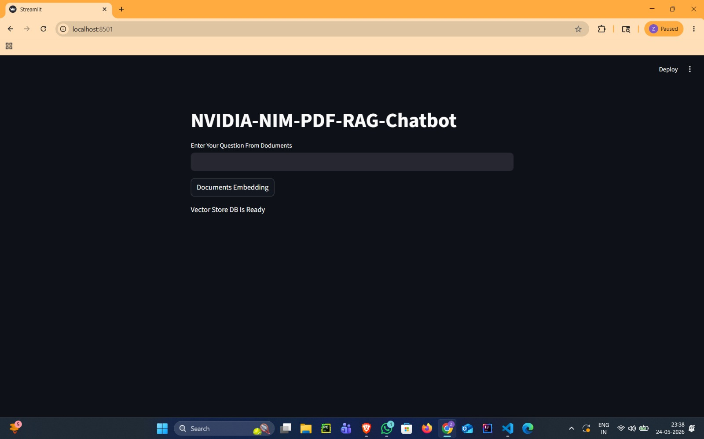
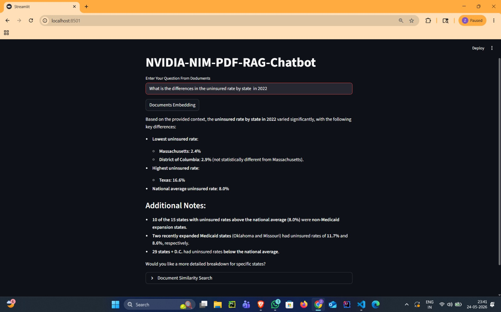
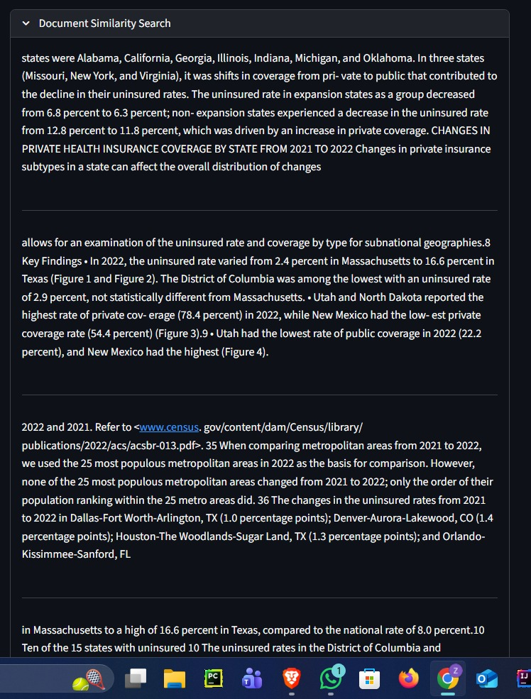

# NVIDIA NIM PDF RAG Chatbot

A powerful Retrieval-Augmented Generation (RAG) chatbot built using:

- NVIDIA NIM APIs
- LangChain
- FAISS Vector Database
- Streamlit
- PDF Document Retrieval

This project allows users to upload and query PDF documents using semantic search and NVIDIA-powered Large Language Models.

---

# Features

- PDF Question Answering
- NVIDIA Embeddings
- FAISS Vector Store
- Semantic Search
- Retrieval-Augmented Generation (RAG)
- Streamlit Web Interface
- Context-Aware Responses
- Similarity Search Visualization
- Fast Document Retrieval Pipeline

---

# Tech Stack

- Python
- Streamlit
- LangChain
- NVIDIA NIM
- FAISS
- PyPDF
- Vector Embeddings

---

# Project Structure

```text
nvidia-nim-pdf-rag-chatbot/
│
├── app.py
├── nvidia_api_test.py
├── requirements.txt
├── README.md
├── .env
├── .gitignore
│
├── data/
│   └── us_census/
│       ├── acsbr-015.pdf
│       ├── acsbr-016.pdf
│       ├── acsbr-017.pdf
│       └── p70-178.pdf
│
├── screenshots/
│   ├── home.png
│   ├── response.png
│   └── similarity_search.png
```

---

# How It Works

```text
PDF Documents
      ↓
PyPDFDirectoryLoader
      ↓
RecursiveCharacterTextSplitter
      ↓
NVIDIA Embeddings
      ↓
FAISS Vector Store
      ↓
Retriever
      ↓
LangChain Retrieval Chain
      ↓
NVIDIA NIM LLM
      ↓
Generated Response
```

---

# Installation

## 1. Clone the Repository

```bash
git clone https://github.com/shaik-zaid/nvidia-nim-pdf-rag-chatbot.git
```

```bash
cd nvidia-nim-pdf-rag-chatbot
```

---

## 2. Create Virtual Environment

### Windows

```bash
python -m venv venv
```

```bash
venv\Scripts\activate
```

---

## 3. Install Dependencies

```bash
pip install -r requirements.txt
```

---

# Environment Variables

Create a `.env` file in the root directory:

```env
NVIDIA_API_KEY=your_nvidia_api_key
```

---

# Run the Application

```bash
streamlit run app.py
```

---

# Usage

## Step 1

Click on:

```text
Documents Embedding
```

to generate embeddings and create the vector database.

---

## Step 2

Ask questions related to the PDF documents.

Example:

```text
What is the uninsured rate by state in 2022?
```

---

## Step 3

The chatbot retrieves the most relevant document chunks and generates contextual responses.

---

# Screenshots

## Home Interface



---

## Generated Response



---

## Document Similarity Search



---

# Main Components

## NVIDIAEmbeddings

Used for converting document chunks into vector embeddings.

---

## FAISS

Used as the vector database for semantic similarity search.

---

## ChatNVIDIA

Used for generating answers from retrieved document context.

---

## Retrieval Chain

Combines:
- retriever
- prompt
- LLM

to generate accurate contextual answers.

---

# Example Workflow

```text
User Question
      ↓
Retriever Searches Similar Chunks
      ↓
Relevant Context Retrieved
      ↓
LLM Generates Final Answer
      ↓
Response Displayed in Streamlit
```


---

# Future Improvements

- Multi-PDF Upload Support
- Conversational Memory
- Streaming Responses
- Source Citations
- Chat History
- Hybrid Search
- Cloud Deployment

---

# Author

Shaik Zaid

---

# License

This project is created for the learning purpose